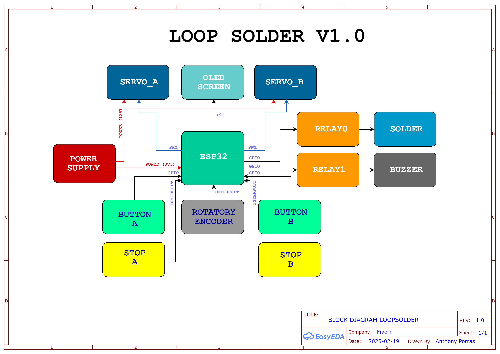

# LoppSolder 🤖🔧

## Descripción General del Proyecto

**LoppSolder** es un sistema automatizado diseñado para optimizar procesos industriales mediante el uso de servomotores y sensores. Con la integración de un ESP32, el sistema se conecta vía WiFi 🌐 para enviar información en tiempo real a Google Sheets. Entre sus funcionalidades destacan:

- **🔄 Bucles de funcionamiento:** Ciclos operativos automatizados para realizar procesos de soldadura.
- **📶 Comunicación WiFi:** Conexión inalámbrica que permite enviar datos a la nube.
- **📊 Envío de datos a Google Sheets:** Registro de fecha, hora y la finalización del bucle "A".
- **🚨 Sistema de sensores de seguridad:** Supervisión y alerta en caso de activación de sensores, como la barrera de protección.

## Características y Componentes 🛠️

El sistema cuenta con los siguientes componentes:

- **📡 ESP32**
- **🦾 Servomotores**
- **📺 Pantalla OLED**
- **🔘 Botones y Encoder**
- **🔌 Fuente de alimentación**



### Integración del Sistema ⚙️

El sistema opera de la siguiente forma:
- Los servomotores y sensores coordinan el proceso industrial.
- El ESP32 gestiona los bucles de funcionamiento y, al finalizar el bucle A, se registra en Google Sheets la fecha 📅, hora 🕒 y estado del proceso.
- La conexión con Google Sheets permite una fácil visualización y seguimiento de los datos en tiempo real ☁️.

### Características Innovadoras 💡

- **📈 Conexión directa con Google Sheets:** Permite el registro y seguimiento automatizado de la operación.
- **⚙️ Configuración de parámetros:** Facilita ajustes y adaptaciones del sistema a diferentes requerimientos industriales.

## Tecnologías y Dependencias 💻

- **Lenguajes y Frameworks:**  
  El firmware se desarrollará en C/C++ 🖥️ para el ESP32.

- **Dependencias:**  
  Aún se definirán, pero se espera el uso de librerías para:
  - 🎛️ Control de servomotores.
  - 📺 Gestión de la pantalla OLED.
  - 📶 Conexión WiFi.
  - 📡 Comunicación con Google Sheets (probablemente mediante HTTP o APIs específicas).

## Instalación y Configuración 🔧

### Clonar el Repositorio 🐙

Aunque el proyecto es privado 🔒, si en algún momento se permite el acceso, para clonarlo en local se puede usar:

```bash
git clone https://github.com/tuUsuario/LoppSolder.git