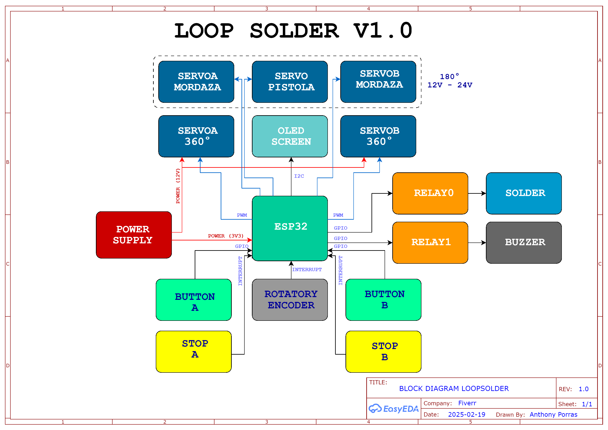

# LoppSolder 🤖🔧

## Descripción General del Proyecto

**LoppSolder** es un sistema automatizado diseñado para optimizar procesos industriales mediante el uso de servomotores y sensores. Con la integración de un ESP32, el sistema se conecta vía WiFi 🌐 para enviar información en tiempo real a Google Sheets. Entre sus funcionalidades destacan:

- **🔄 Bucles de funcionamiento:** Ciclos operativos automatizados para realizar procesos de soldadura.
- **📶 Comunicación WiFi:** Conexión inalámbrica que permite enviar datos a la nube.
- **📊 Envío de datos a Google Sheets:** Registro de fecha, hora y la finalización del bucle "A".
- **🚨 Sistema de sensores de seguridad:** Supervisión y alerta en caso de activación de sensores, como la barrera de protección.

## Características y Componentes 🛠️

El sistema cuenta con los siguientes componentes:

- **📡 ESP32**
- **🦾 Servomotores**
- **📺 Pantalla OLED**
- **🔘 Botones y Encoder**
- **🔌 Fuente de alimentación**



# Bill of Materials (BOM)

| Ítem                                     | Descripción                                                                                                       | Cantidad | Precio Unitario | Link                  |
|------------------------------------------|-------------------------------------------------------------------------------------------------------------------|----------|-----------------|-----------------------|
| **Power Supply**                         | Fuente de alimentación para todo el circuito con salida de 12V 3A (según requerimientos).                       | 1        | $4.44             | [Enlace](https://es.aliexpress.com/item/1005006987242244.html?spm=a2g0o.productlist.main.3.6631faa8QDx076&algo_pvid=6c8ef64f-3580-49c6-a710-ff1509385b64&algo_exp_id=6c8ef64f-3580-49c6-a710-ff1509385b64-1&pdp_ext_f=%7B%22order%22%3A%221335%22%2C%22eval%22%3A%221%22%7D&pdp_npi=4%40dis%21USD%215.12%212.39%21%21%2137.08%2117.32%21%402103209b17400090895613464e1b0a%2112000038965797731%21sea%21PE%21912779390%21X&curPageLogUid=juGXE7S74jOk&utparam-url=scene%3Asearch%7Cquery_from%3A)           |
| **Power Supply**                         | Módulo de potencia de 3,3 v, 5v, 12v                       | 1        | $1.14             | [Enlace](https://es.aliexpress.com/item/1005005193771313.html?spm=a2g0o.productlist.main.3.296f2f36B0AE95&algo_pvid=1f22c934-0a5d-4f04-8fde-5719568bccfe&algo_exp_id=1f22c934-0a5d-4f04-8fde-5719568bccfe-1&pdp_ext_f=%7B%22order%22%3A%225%22%2C%22eval%22%3A%221%22%7D&pdp_npi=4%40dis%21USD%211.14%211.14%21%21%211.14%211.14%21%40210318e817400116222721664e85fd%2112000032072647542%21sea%21PE%21912779390%21X&curPageLogUid=Ihvhlq6pL4Cp&utparam-url=scene%3Asearch%7Cquery_from%3A)           |
| **ESP32**                                | Microcontrolador Wi-Fi + Bluetooth con pines GPIO, PWM, I2C, SPI, etc.                                            | 1        | $4.77             | [Enlace](https://es.aliexpress.com/item/1005007357884914.html?spm=a2g0o.productlist.main.1.344e43614W8wWW&algo_pvid=6c64a892-b5f3-44b7-9793-240b6e114a1c&algo_exp_id=6c64a892-b5f3-44b7-9793-240b6e114a1c-0&pdp_ext_f=%7B%22order%22%3A%221%22%2C%22eval%22%3A%221%22%7D&pdp_npi=4%40dis%21USD%2114.90%214.77%21%21%21107.98%2134.55%21%402101ea8c17400084159023277e49d4%2112000040412298449%21sea%21PE%21912779390%21X&curPageLogUid=TiZ3doCC1w6L&utparam-url=scene%3Asearch%7Cquery_from%3A)           |
| **Rotary Encoder**                       | Encoder rotatorio con salidas A/B para medir giro y dirección.                                                    | 1        | $0.52             | [Enlace](https://es.aliexpress.com/item/32908505224.html?spm=a2g0o.productlist.main.13.3274248cYwFWKd&algo_pvid=7b8d3002-ab88-4026-8265-839b8fa833c4&algo_exp_id=7b8d3002-ab88-4026-8265-839b8fa833c4-6&pdp_ext_f=%7B%22order%22%3A%224%22%2C%22eval%22%3A%221%22%7D&pdp_npi=4%40dis%21USD%210.65%210.52%21%21%210.65%210.52%21%402103241117400106475678189e9e26%2165901542625%21sea%21PE%21912779390%21X&curPageLogUid=Rp1tjfoiBugr&utparam-url=scene%3Asearch%7Cquery_from%3A)           |
| **Pantalla 2.42" I2C OLED**             | Pantalla OLED de 2.42" con interfaz I2C (típ. 128×64), alimentación a 3.3 V o 5 V.                                  | 1        | $8.81             | [Enlace](https://es.aliexpress.com/item/1005002766729064.html?spm=a2g0o.productlist.main.5.285e51dahZLtLm&algo_pvid=26142b1c-4d28-425f-b278-9f5998d1ef1e&algo_exp_id=26142b1c-4d28-425f-b278-9f5998d1ef1e-2&pdp_ext_f=%7B%22order%22%3A%22241%22%2C%22eval%22%3A%221%22%7D&pdp_npi=4%40dis%21USD%219.21%218.81%21%21%219.21%218.81%21%402103205217400108051501565e974e%2112000043383276407%21sea%21PE%21912779390%21X&curPageLogUid=IN1vUpsRs9AB&utparam-url=scene%3Asearch%7Cquery_from%3A)           |
| **Servo Magnético (ASMC-LQB)**           | Servo con codificador magnético, 60 kg·cm, engranaje helicoidal, reducción 360°, apagado automático.              | 2        | $28.25             | [Enlace](https://es.aliexpress.com/i/1005007773750682.html)           |
| **Servo Motor**           | Servo 180°, apagado automático.              | 3        | $             | [Enlace]()           |
| **Relé**                                 | Módulo de relé 2 canales para conmutar cargas externas (requerirá transistor o driver integrado).                            | 2        | $2.19             | [Enlace](https://es.aliexpress.com/item/32882105105.html?spm=a2g0o.productlist.main.1.1ba61284CdLblH&algo_pvid=99441696-c360-47c5-a425-2db596b37fe8&algo_exp_id=99441696-c360-47c5-a425-2db596b37fe8-0&pdp_ext_f=%7B%22order%22%3A%2222%22%2C%22eval%22%3A%221%22%7D&pdp_npi=4%40dis%21USD%211.04%211.04%21%21%211.04%211.04%21%402103241117400109805046117e9e0e%2165586103649%21sea%21PE%21912779390%21X&curPageLogUid=gg726CU3YzlX&utparam-url=scene%3Asearch%7Cquery_from%3A)           |
| **Botón A y Botón B**                    | Botones pulsadores de entrada digital.                                                                            | 2        | $1.23             | [Enlace](https://es.aliexpress.com/item/4001148756697.html?spm=a2g0o.productlist.main.41.2d016f2ecx5sbu&algo_pvid=dca6552d-d879-409c-a0ae-f995d29a3fd6&algo_exp_id=dca6552d-d879-409c-a0ae-f995d29a3fd6-20&pdp_ext_f=%7B%22order%22%3A%22580%22%2C%22eval%22%3A%221%22%7D&pdp_npi=4%40dis%21USD%211.23%211.23%21%21%211.23%211.23%21%402103273e17400111026342241e3ffe%2110000014908266013%21sea%21PE%21912779390%21X&curPageLogUid=QsgE7hwsTsOh&utparam-url=scene%3Asearch%7Cquery_from%3A)           |


### Integración del Sistema ⚙️

El sistema opera de la siguiente forma:
- Los servomotores y sensores coordinan el proceso industrial.
- El ESP32 gestiona los bucles de funcionamiento y, al finalizar el bucle A, se registra en Google Sheets la fecha 📅, hora 🕒 y estado del proceso.
- La conexión con Google Sheets permite una fácil visualización y seguimiento de los datos en tiempo real ☁️.

### Características Innovadoras 💡

- **📈 Conexión directa con Google Sheets:** Permite el registro y seguimiento automatizado de la operación.
- **⚙️ Configuración de parámetros:** Facilita ajustes y adaptaciones del sistema a diferentes requerimientos industriales.

## Tecnologías y Dependencias 💻

- **Lenguajes y Frameworks:**  
  El firmware se desarrollará en C/C++ 🖥️ para el ESP32.

- **Dependencias:**  
  Aún se definirán, pero se espera el uso de librerías para:
  - 🎛️ Control de servomotores.
  - 📺 Gestión de la pantalla OLED.
  - 📶 Conexión WiFi.
  - 📡 Comunicación con Google Sheets (probablemente mediante HTTP o APIs específicas).

## Instalación y Configuración 🔧

### Clonar el Repositorio 🐙

Aunque el proyecto es privado 🔒, si en algún momento se permite el acceso, para clonarlo en local se puede usar:

```bash
git clone https://github.com/tuUsuario/LoppSolder.git